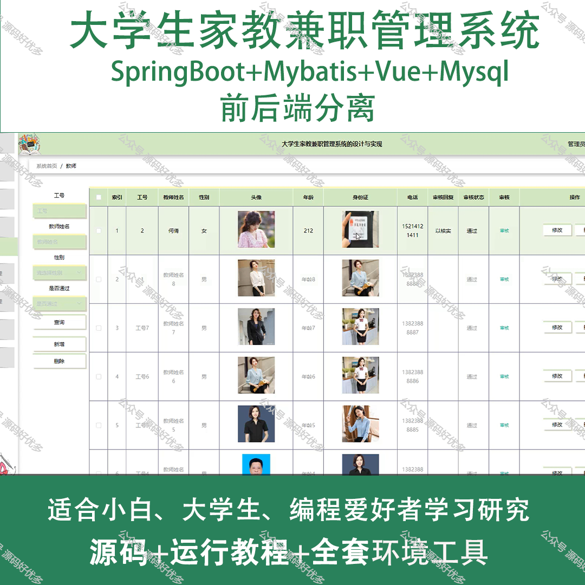
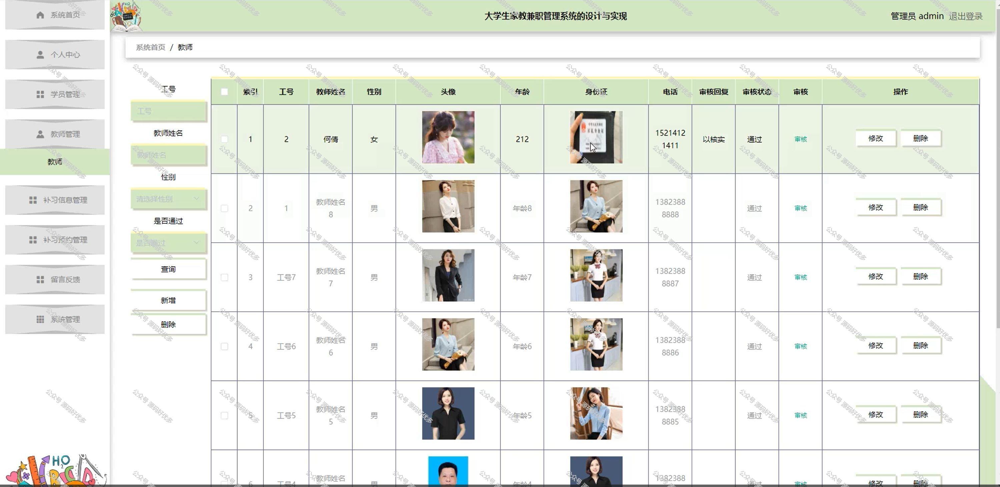
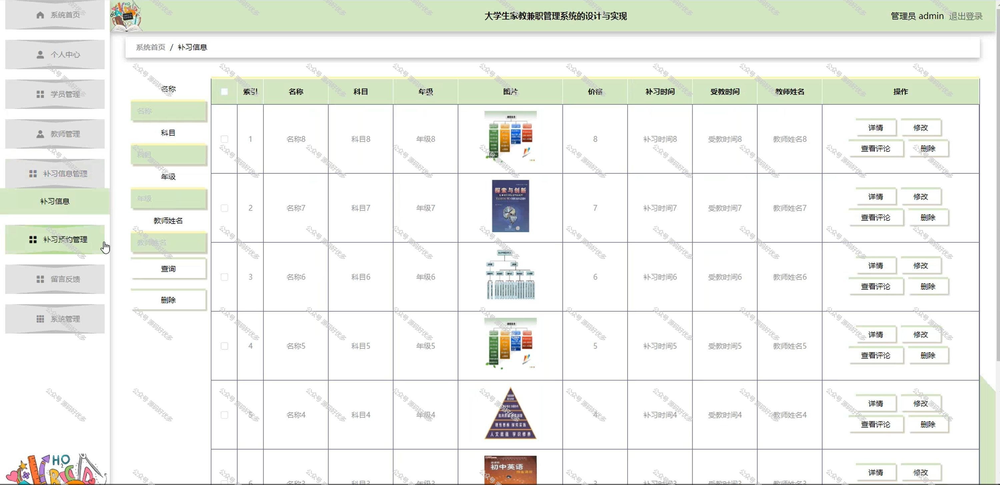
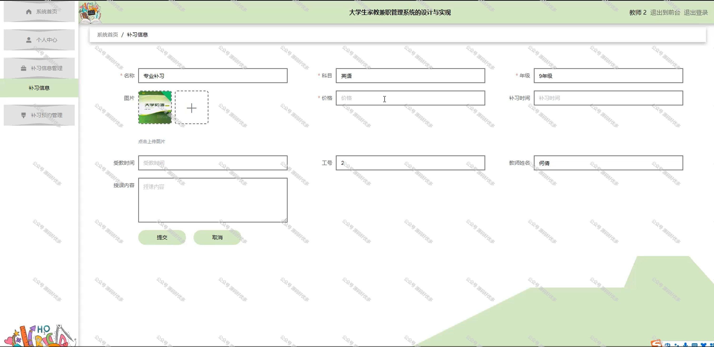
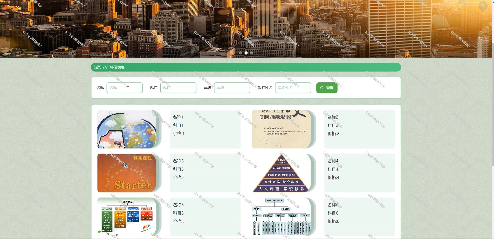

 
## 查看主页获取源码

> **作者介绍**： **✌**全网粉丝10W+本平台特邀作者、博客专家、CSDN新星计划导师、java领域优质创作者,博客之星、掘金/华为云/阿里云/InfoQ等平台优质作者、专注于项目实战 **✌**

  

### 一、作品包含

源码+数据库+全套环境和工具资源+部署教程

### 二、项目技术

前端技术：Html、Css、Js、Vue、Element-ui

数据库：MySQL

后端技术：Java、Spring Boot、MyBatis

  

### 三、运行环境

开发工具：IDEA/eclipse

数据库：MySQL5.7

数据库管理工具：Navicat10以上版本

环境配置软件： JDK1.8+Maven3.6.3

前端Nodejs：14

### 四、项目介绍
项目编号：springbootA138

在高等教育普及化和就业市场竞争日益激烈的背景下，大学生家教兼职管理系统应运而生，该系统旨在为大学生提供一个便捷、安全的家教兼职信息发布与匹配平台，同时为提供高效、可靠的家教资源选择服务，通过规范化的管理流程，促进家教市场的健康发展，帮助大学生实现自我价值和经济独立。

前台学员功能：登录注册、浏览首页、补习信息、网站公告、留言反馈、后台管理和个人中心、我的收藏。

后台分为管理员、学员、教师
管理员的功能：系统首页、个人中心、学员管理、教师管理、补习信息管理、补习预约管理、留言反馈、系统管理。
学员的功能：系统首页、个人中心、补习预约管理。
教师的功能：系统首页、个人中心、补习信息管理、补习预约管理。

### 五、运行截图

  
